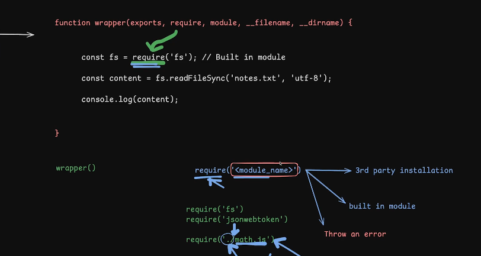

# Modules

1. Built in modules
2. 3rd party Modules ( External Modules ) - npm i <module_name>
3. Custom Modules ( Internal Modules ) - my own module

## File system module - Built in module - index.js

- refer to official docs - File System - https://nodejs.org/docs/latest/api/fs.html#file-system
- we know where the `require` function is coming from in NodeJs - [NodeJs Module Wrapper](https://nodejs.org/api/modules.html#modules_the_module_wrapper) as whenever we run the js file - our code goes into the nodejs wrapper function which provides `require` function ..etc.
  
- Then require modules first checks the 3rd party installed modules & then checks if there are any built-in modules - if not then it will thrown an error of the <module_name> we're looking for. and it also caches the module so it doesn't has to load again and again.
- 
